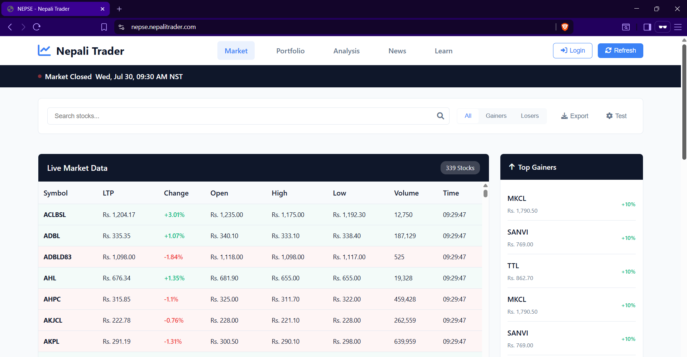
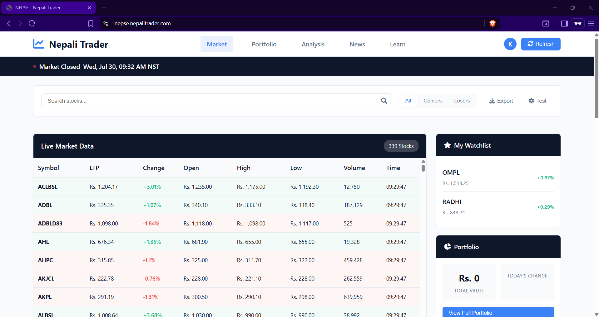

# NEPSE Live Market Tracker

🚀 **Live Demo:** [https://nepse.nepalitrader.com/](https://nepse.nepalitrader.com/)

A modern, responsive web application for tracking NEPSE (Nepal Stock Exchange) live market data with real-time updates, portfolio management, and watchlist features.



## ✨ Features

### 🔴 **Live Market Data**

- Real-time NEPSE stock prices and market data
- Automatic refresh during market hours (11 AM - 3 PM NST)
- Market status indicator with live clock
- NEPSE index tracking with change indicators

### 📊 **Advanced Filtering & Search**

- Search stocks by symbol
- Filter by gainers, losers, and all stocks
- Sortable data columns
- Real-time data updates every 30 seconds

### 👤 **User Management**

- User authentication system
- Personal portfolio tracking
- Custom watchlist management
- Persistent user data storage

### 📱 **Responsive Design**

- Mobile-first responsive design
- Modern dark/light theme
- Intuitive user interface
- Cross-browser compatibility

### 📈 **Market Analysis**

- Top gainers and losers sidebar
- Portfolio summary with P&L tracking
- Market trend indicators
- Volume and price analysis

### 🔧 **Additional Features**

- Data export to CSV
- Connection testing tools
- Keyboard shortcuts support
- Auto-login functionality



## 🛠️ Tech Stack

### Frontend

- **HTML5** - Semantic markup
- **CSS3** - Modern styling with CSS variables
- **Vanilla JavaScript** - ES6+ features
- **Font Awesome** - Icon library
- **Responsive Design** - Mobile-first approach

### Backend

- **PHP 7.4+** - Server-side processing
- **cURL/file_get_contents** - Web scraping
- **DOMDocument** - HTML parsing
- **JSON API** - Data exchange format

### Data Source

- **MeroLagani.com** - NEPSE market data scraping
- **Real-time updates** - During market hours
- **Fallback data** - Sample data when scraping fails

## 📋 API Endpoints

### Get Market Data

```
GET /nepse_scraper.php
```

Returns live market data in JSON format.

### Export Data

```
GET /nepse_scraper.php?action=export
```

Downloads market data as CSV file.

### System Test

```
GET /nepse_scraper.php?test=1
```

Returns system status and configuration.

## 🎯 Usage

### Basic Usage

1. Open the application in your browser
2. View live market data on the main dashboard
3. Use search and filters to find specific stocks
4. Click refresh to update data manually

### User Features

1. **Login/Register** - Create account for personalized features
2. **Watchlist** - Click star icon next to stocks to add to watchlist
3. **Portfolio** - Track your investments (coming soon)
4. **Export** - Download current market data as CSV

### Keyboard Shortcuts

- `Ctrl+R` - Refresh data
- `Ctrl+E` - Export data
- `Ctrl+L` - Open login modal
- `Esc` - Close modals

## 🔧 Configuration

### Market Hours

The application automatically detects Nepal market hours:

- **Days:** Sunday to Thursday
- **Time:** 11:00 AM to 3:00 PM (Nepal Standard Time)
- **Auto-refresh:** Every 30 seconds during market hours

### Timezone Settings

```php
// In nepse_scraper.php
date_default_timezone_set('Asia/Kathmandu');
```

### Scraping Configuration

```php
private $baseUrl = 'https://merolagani.com/LatestMarket.aspx';
private $timeout = 30;
```

## 🔍 Troubleshooting

### Common Issues

1. **No Data Loading**

   - Check internet connection
   - Verify cURL is enabled
   - Test with `/nepse_scraper.php?test=1`

2. **CORS Errors**

   - Ensure proper headers are set in PHP
   - Check web server configuration

3. **Scraping Failures**

   - Application falls back to sample data
   - Check if source website structure changed

4. **Performance Issues**
   - Increase PHP memory limit
   - Optimize cURL timeout settings

### Debug Mode

Enable PHP error reporting for debugging:

```php
error_reporting(E_ALL);
ini_set('display_errors', 1);
```

## 🤝 Contributing

We welcome contributions! Please follow these steps:

1. Fork the repository
2. Create a feature branch (`git checkout -b feature/amazing-feature`)
3. Commit your changes (`git commit -m 'Add amazing feature'`)
4. Push to the branch (`git push origin feature/amazing-feature`)
5. Open a Pull Request

### Development Guidelines

- Follow existing code style
- Add comments for complex logic
- Test across different browsers
- Ensure mobile responsiveness

## 🙏 Acknowledgments

- **MeroLagani.com** - For providing NEPSE market data
- **Font Awesome** - For beautiful icons
- **Nepal Stock Exchange (NEPSE)** - For market data

## 🔗 Links

- **Live Demo:** [https://nepse.nepalitrader.com/](https://nepse.nepalitrader.com/)
- **Main Website:** [Nepali Trader](https://nepalitrader.com/)
- **Report Issues:** [GitHub Issues](https://github.com/khrishman/nepse-live-market-tracker/issues)
- **Feature Requests:** [GitHub Discussions](https://github.com/khrishman/nepse-live-market-tracker/discussions)

## 📊 Project Status


---

**Made with ❤️ for the Nepali trading community**

_Disclaimer: This application is for educational and informational purposes only._
